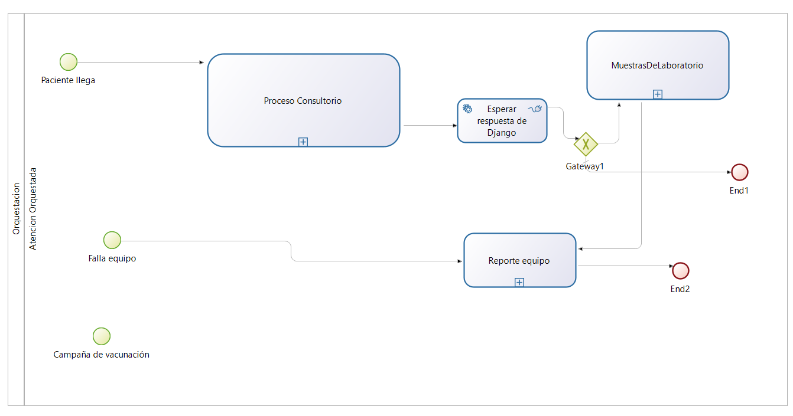

# Sistema de Atención Ambulatoria — Proyecto BPM (Bonitasoft)

Repositorio BPM: [dse-hospital-bpmn](https://github.com/CSV-Alex/dse-hospital-bpmn/)

Repositorio Backend: [HospitalDjangoAPI](https://github.com/CSV-Alex/HospitalDjangoAPI)

---

## 1. Equipo y contexto
- Equipo: HospitalLINK
- Integrantes:
  - Alex Enrique Cañapataña Vargas
  - Berly Miuler Dueñas Mandamientos

- Cliente: Hospital Regional Honorio Delgado
- Propósito: Automatizar el flujo de atención ambulatoria en consultorios externos, orquestando desde la llegada del paciente, su registro, evaluación hasta la posible derivación a laboratorio. La orquestación y la integración con servicios back-end se realizan de forma asíncrona mediante RabbitMQ.

---

## 2. Visión general de la aplicación BPM
Se ha implementado una Living Application en Bonitasoft (Application Page) que ofrece:
- Navegación por roles: `Enfermería`, `Médico Especialista`, `Sistema de Información`.
- Flujo de navegación en la UI: Rol → Procesos → Instancias → Estado.
- Menú y vistas restringidas por rol para iniciar procesos, ver instancias activas y consultar detalles de cada caso.

---

## 3. Procesos de negocio (BPMN)
### 3.1 Proceso principal: Atención Médica — Consultorios Externos
- Registrar llegada (Tarea humana — Enfermería): captura datos del paciente.
- Verificar identidad (Tarea automática): comprobación en sistema.
- Triaje / Signos vitales (Tarea humana — Enfermería).
- Evaluación y diagnóstico (Tarea humana — Médico Especialista).
- Decisión automática: determinar si se requieren exámenes.
- En caso de requerir exámenes, se invoca el subproceso `MuestrasDeLaboratorio`.
- Registro final: `Registrar Historia Clínica en el sistema` (Tarea automática que publica mensaje en RabbitMQ).

### 3.2 Proceso: Admisión y Hospitalización
- **Recepción y Validación:** Recepción de orden de internamiento y verificación de disponibilidad de camas (Admisión).
- **Facturación / Seguros:** Validación de cobertura financiera (SIS).
- **Enfermería:** Preparación de cama, traslado de paciente y registro de signos vitales.
- **Área Médica:** Apertura de Historia Clínica y emisión de plan médico.
- **Registro final:** Tareas automáticas de integración (RabbitMQ) para registrar la hospitalización en el backend y esperar confirmación asíncrona.

### 3.3 Orquestador global (arquitectura guiada por eventos)
- Orquestador inicia `Proceso Consultorio` vía `Call Activity`.
- Publica en la cola `solicitud_consultorio` para que el backend (Django) lo consuma.
- Escucha la cola `evento_consultorio_completado` (conector `Consume Message`) esperando respuesta (`"true"`/`"false"`).
- Tras recibir el mensaje, una operación convierte el texto en booleano y un XOR Gateway decide el flujo siguiente.



### 3.4 Proceso de Mantenimiento Biomédico
- Reportar falla (Tarea humana — Operador): captura descripción del equipo dañado.
- Evaluar equipo (Tarea humana — Técnico de Mantenimiento): determina si la falla es reparable.
- Decisión automática: según `isRepairable` se decide reparar o dar de baja.
- Reparar equipo (Tarea humana — Técnico de Mantenimiento): ejecuta la reparación y registra si fue exitosa.
- Actualizar reporte (Tarea automática): envía los datos actualizados del reporte a Django vía RabbitMQ.


---

## 4. Elementos BPMN utilizados

### Consultorio Externo
- Modelo de Datos (BDM): Paciente, Cita, Triaje, HistoriaClinica, PeticionPrueba.
- Contratos: cada tarea humana tiene contrato (ej. PacienteInput con nombre, fecha de nacimiento, etc.).
- Roles: Enfermería, Médico Especialista, Sistema de Información.
- UI Forms: formularios HTML5 personalizados por tarea.
- Tareas automáticas: validaciones internas y conectores con el broker.
- Eventos: publicación/consumo de mensajes con RabbitMQ.
- Subprocesos y CallActivity: invocación a MuestrasDeLaboratorio.

### Mantenimiento Biomédico
- Modelo de Datos (BDM):
  - descripcion_falla (string) — descripción del incidente reportado.
  - isRepairable (booleano) — indica si el equipo requiere reparación.
  - repairSuccessful (booleano) — indica si la reparación fue exitosa.
- Contratos: ReporteFallaInput con descripcion_falla, equipo_id, external_id.
- Roles: Operador, Técnico de Mantenimiento, Sistema de Información.
- UI Forms: formularios HTML5 para reportar falla, evaluar equipo y actualizar reporte.
- Tareas automáticas: envío de datos a Django (RabbitMQ) y actualización de reportes.
- Eventos: consumo de mensajes desde la cola mantenimiento_reporte.
- Uso del objeto `ReporteFalla`: almacena la descripción de la falla (`descripcion_falla`), si el equipo es reparable (`isRepairable`) y si la reparación fue exitosa (`repairSuccessful`). Este objeto se actualiza a lo largo del flujo desde que se reporta el incidente hasta que se completa la reparación.

---

## 5. Integración con RabbitMQ (Broker de Mensajes)
- Broker: RabbitMQ (local en desarrollo).
- Usuario/Password por defecto: `guest` / `guest` (usar variables de entorno en producción).
- Colas usadas:
  - Publicación: `solicitud_consultorio` (desde Bonitasoft → Backend Django)
  - Consumo: `evento_consultorio_completado` (desde Bonitasoft → mensaje de respuesta del backend)
- Conector Publish (tarea automática `Registrar Historia Clínica en el sistema`):
  - Host: `localhost:5672`
  - Cola destino: `solicitud_consultorio`
  - Payload (Groovy):
```groovy
return '{"numeroHistoriaClinica": "' + pacienteActual.numeroHistoriaClinica + '", "nombreCompleto": "' + pacienteActual.nombreCompleto + '", "fechaNacimiento": "' + pacienteActual.fechaNacimiento + '", "necesitaExamen": ' + necesitaExamen + '}'
```
  - Content-Type: `application/json`

- Conector Consume (tarea automática `Esperar respuesta de Django` en Orquestador):
  - Host: `localhost:5672`
  - Cola: `evento_consultorio_completado`
  - Output variable: `mensajeRecibidoTexto` (tipo Text, propiedad Is multiple = true) — el conector devuelve un array de textos.

Esto convierte la cadena `"true"`/`"false"` en booleano usable por la puerta XOR.

---

## 6. Servicios Web consumidos (Backend Django) — documentación y ejemplos
Nota: La especificación OpenAPI se ha exportado desde el backend.

Servicios principales:

1) Recurso: ConsultorioExterno — Registrar consulta ambulatoria  
- Propósito: recibir la solicitud generada por Bonitasoft y persistir el registro de la consulta/paciente.  
- Operación:
  - POST /api/consultorio/
  - Payload ejemplo:
```json
{
  "numeroHistoriaClinica": "HC12345",
  "nombreCompleto": "Juan Pérez",
  "fechaNacimiento": "1980-05-12",
  "necesitaExamen": true
}
```
- Modelo principal: Paciente (entidad con campos: numeroHistoriaClinica, nombreCompleto, fechaNacimiento, etc.)

Repositorio del backend y Swagger UI (local): `http://localhost:8000/swagger/` 

---

## 7. Diagrama de composición de servicios

Flujo arquitectónico (resumen):

Usuario Web (Bonita UI) → Bonitasoft (Orquestador) → RabbitMQ (colas) → Django (Backend REST) → base de datos y publicación de evento → RabbitMQ → Bonitasoft (Orquestador) → XOR Gateway → `MuestrasDeLaboratorio` o finalización.

---

## 9. Instrucciones de ejecución
Requisitos:
- Bonita Studio / Bonita BPM 2025u2
- Java / Tomcat (según instalación de Bonita)
- Dependencias JAR: `kafka-clients`, `amqp-client`, `netty-all` (colocar en `workspace/tomcat/lib` de Bonita si es necesario)
- RabbitMQ (local o remoto) en `localhost:5672`
- Backend Django corriendo en `http://localhost:8000` (o ajustar hosts en conectores)

Pasos:
1. Clonar el proyecto en Bonita Studio.
2. Asegurarse de que las JAR necesarias están en `workspace/tomcat/lib`.
3. Iniciar el servidor Bonita (por defecto en puerto `8080`) y publicar los procesos.
4. Iniciar el backend Django y verificar Swagger en `http://localhost:8000/swagger/`.
5. Iniciar RabbitMQ (instalación local o docker).
6. Iniciar una instancia del proceso `Orquestacion` desde la Application Page.
7. Verificar colas en RabbitMQ y mensajes: `solicitud_consultorio` y `evento_consultorio_completado`.
8. Revisar logs del backend para ver consumo de `solicitud_consultorio` y publicación de `evento_consultorio_completado`.

---

## 10. Gestión del proyecto y control de versiones
- Ramas usadas:
  - `main` (producción)
  - `development` (integración / versión oficial entregable)
  - `feature/integracion-rabbitmq-consultorios` (desarrollo de integración asíncrona)
  - `feature/reparacionEquipos-rabbitmq` (desarrollo de mantenimiento biomédico con RabbitMQ)
- Gestión ágil: tablero Kanban con columnas Backlog / To Do / In Progress / Review / Done y checklists por tarea (ejemplo: "Configurar colas RabbitMQ", "Conectar Publish/Consume", "Solucionar asignación booleana").

---

## 11. Calidad, pruebas y consideraciones
- Validar Payloads y contratos entre Bonitasoft y Backend (tipos, campos obligatorios).
- Añadir pruebas de integración end-to-end: publicación en `solicitud_consultorio` → backend procesa → publica `evento_consultorio_completado` → orquestador continúa flujo.
- Evitar credenciales en texto plano: usar variables de entorno o secretos en producción.
- Logs y monitoreo: habilitar logging suficiente en backend y revisar colas en RabbitMQ para detectar mensajes perdidos.
